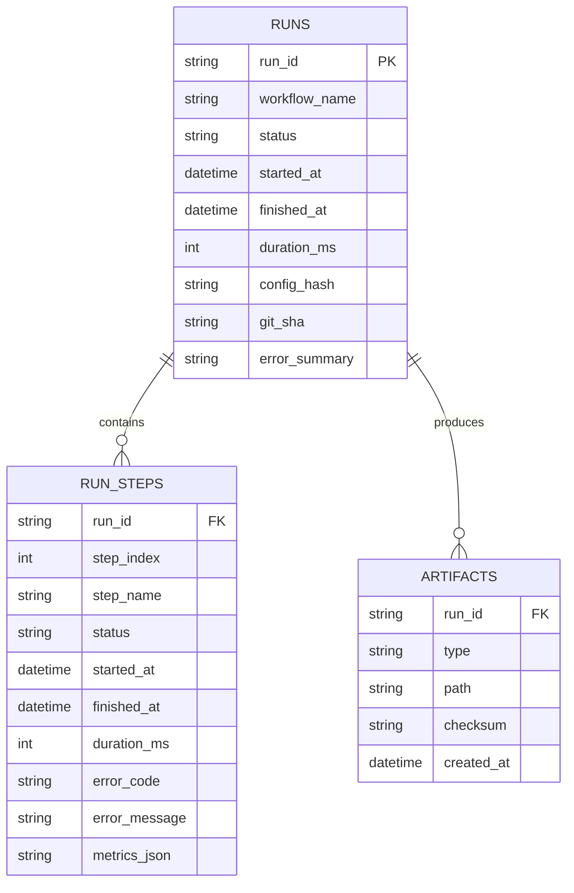

# Run model

The run model is the backbone of observability. It answers:

- What ran?
- When did it run?
- Which step failed?
- Where are the artifacts/audit exports?

This project uses a **file-backed** run store under `runs/<run_id>/` (no DB required), but the **schema is stable** and can be migrated to a DB later without changing concepts.

---

## Core concepts

### Run ID
Every engine execution generates a **new** `run_id` and writes to a **new** directory:

- `runs/<run_id>/...`

Runs are **append-only**. Old runs are never overwritten.

### Entities (logical schema)

#### RUNS
One record per engine execution.
- `run_id`, `workflow_name`
- `status` (OK/FAILED)
- `started_at`, `finished_at` (or `ended_at`), `duration_ms`
- `config_hash`, `git_sha` (reproducibility)
- `error_summary` (optional)

#### RUN_STEPS
One record per step execution within a run.
- `run_id`, `step_index`, `step_name`
- `status` (OK/FAILED)
- `started_at`, `finished_at`, `duration_ms`
- `error_code`, `error_message` (optional)
- `metrics` (optional JSON: counts/ids/etc.)

#### ARTIFACTS (optional, future)
A record per file artifact produced by a run.
- `run_id`, `type`, `path`, `checksum`, `created_at`

> Note: ARTIFACT indexing is optional and can be added later. For now, the engine guarantees run summaries + step summaries + logs; workflows may write additional files under `run_dir`.

---

## File-backed implementation (source of truth)

For each run:

```
runs/<run_id>/
  logs.jsonl   # JSONL event stream (run + step events)
  context.json # latest RunState snapshot (persisted after each step + on failure)
  run.json     # run-level summary (stable fields)
  steps.json   # step summaries (stable fields)
  audit.json   # bundle: { run: <run.json>, steps: <steps.json> } (optional but recommended)
  audit.csv    # export: 1 row per step (run fields repeated) (generated by CLI)
  ...workflow artifacts...
```


### `run.json` (run summary)
Minimum stable shape:

```json
{
  "run_id": "uuid",
  "workflow_name": "gmail_to_sheets",
  "status": "OK",
  "started_at": "2026-02-07T10:00:00Z",
  "finished_at": "2026-02-07T10:00:03Z",
  "duration_ms": 3123,
  "config_hash": "…",
  "git_sha": "…",
  "error_summary": null
}
```

### `steps.json` (step summaries)
Minimum stable shape (array):

```json
[
  {
    "step_index": 0,
    "step_name": "fetch_messages",
    "status": "OK",
    "started_at": "2026-02-07T10:00:00Z",
    "finished_at": "2026-02-07T10:00:01Z",
    "duration_ms": 1020,
    "error_code": null,
    "error_message": null,
    "metrics": { "messages": 12 }
  }
]
```

### `audit.json`
Convenience bundle for export tooling:

```json
{
  "run": { "...": "..." },
  "steps": [ { "...": "..." } ]
}
```

### `audit.csv`
Export format (one row per step; run fields repeated). Minimum columns:

```
run_id
workflow_name
run_status
run_started_at
run_finished_at
run_duration_ms
step_index
step_name
step_status
step_started_at
step_finished_at
step_duration_ms
step_error_code
step_error_message
step_metrics_json
```

### Export contract (CLI)
Audit export is generated after-the-fact from run.json + steps.json (or audit.json bundle):

```
gw export <run_id> --format json -> runs/<run_id>/audit.json
gw export <run_id> --format csv -> runs/<run_id>/audit.csv
```

If the run_id directory does not exist, export must fail with a clear message and non-zero exit.

### Diagram (logical schema)

