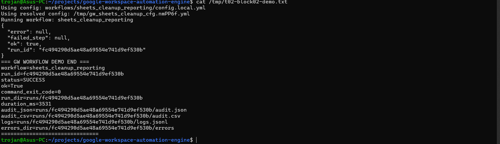
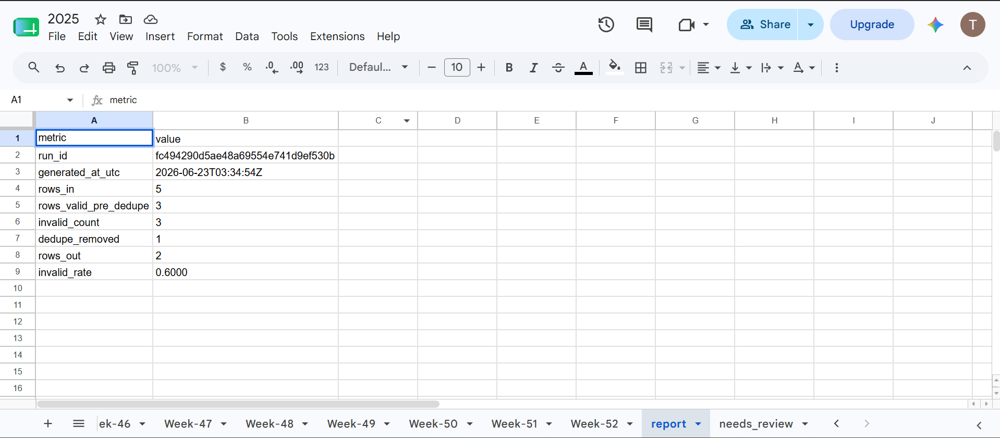
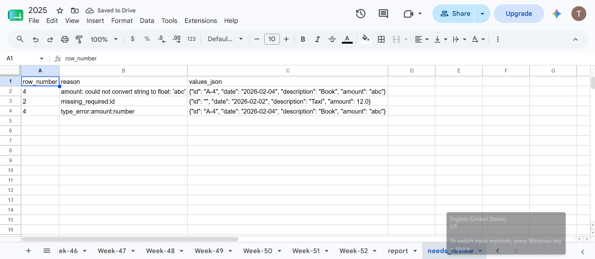
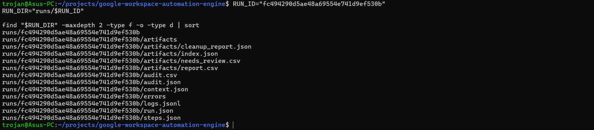
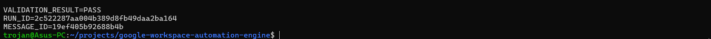
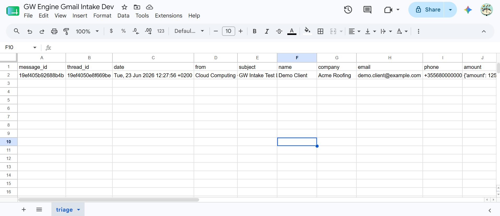
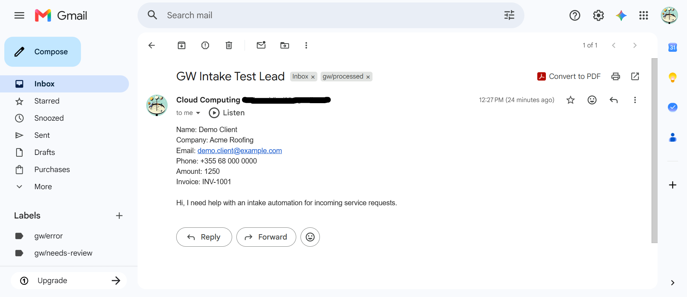
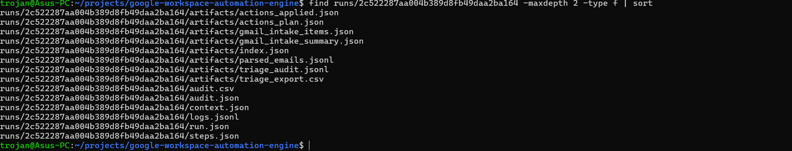

# Google Workspace Automation Engine: Auditable Gmail and Sheets Operations

## Executive summary

The Google Workspace Automation Engine is a Python portfolio project that turns two common manual operations processes into repeatable, reviewable workflows:

- cleaning inconsistent Google Sheets data and separating exceptions for review
- converting matching Gmail messages into a structured Google Sheets triage queue

Both workflows run through a shared command-line engine and produce structured logs, audit exports, run artifacts, and curated screenshots. The proof in this case study comes from repository evidence: one successful Sheets cleanup run and one successful live Gmail-to-Sheets run. No client identity, revenue impact, or estimated time saving is claimed.

## Client and business problem

Many small businesses and operations teams use Gmail and Google Sheets as an informal operating system. Requests arrive in an inbox, details are copied into a spreadsheet, and spreadsheet rows are corrected by hand before they can support reporting or follow-up.

That process creates two related problems:

1. Spreadsheet inputs accumulate missing fields, invalid values, and duplicates, with no consistent record of what was corrected or rejected.
2. Inbox requests are transferred inconsistently, while reviewers lack a shared queue and a reliable indication that a message was processed.

## Why this problem matters

Manual copy/paste and ad hoc cleanup make outcomes depend on the individual operator. Invalid data can disappear without explanation, duplicate records can distort reports, and inbox items can be missed or processed twice. Even when the immediate output looks correct, the business may have no logs or audit trail showing what the automation read, wrote, or changed.

The practical requirement is therefore more than moving data. The process needs deterministic rules, explicit exception handling, idempotent record handling where applicable, and evidence that an operator can inspect after each run.

## Solution overview

The engine provides a common run model for configured Google Workspace workflows. Each execution receives a run ID and writes metadata, step records, structured logs, errors, and workflow-specific artifacts beneath `runs/<run_id>/`. Step-level audit data can also be exported as JSON and CSV.

The two proven workflows address opposite sides of the same operations pipeline:

| Workflow | Input | Operational output | Human-review mechanism |
| --- | --- | --- | --- |
| `sheets_cleanup_reporting` | Raw Google Sheets rows | Clean rows and cleanup metrics | Needs-review rows with explicit reasons |
| `gmail_to_sheets_intake` | Gmail messages matching a configured query | Structured Google Sheets triage rows | Parser confidence/errors, triage status, and Gmail labels |

Generated run directories are intentionally excluded from version control because they can contain environment-specific data. Redacted, curated proof is stored under `runs/_evidence/`.

## Workflow A — Sheets cleanup and reporting

### Problem solved

Operational spreadsheets drift as dates and amounts use inconsistent formats, required fields go missing, and duplicate records accumulate. The workflow creates a repeatable cleanup funnel without silently discarding rows that need intervention.

### Automation steps

1. Read rows from a configured Google Sheet input tab.
2. Normalize configured strings, dates, and numbers.
3. Validate required fields and data types.
4. Preserve invalid rows with row-level reasons in a needs-review output.
5. Deduplicate validated rows using normalized key values.
6. Write report and needs-review tabs and per-run artifacts.
7. Record structured logs and export step-level audit data.

### Outputs created

The documented run contract includes:

- `artifacts/report.csv` for cleanup funnel metrics
- `artifacts/needs_review.csv` for rejected rows and reasons
- `artifacts/cleanup_report.json` for counts, examples, and a cleaned preview
- `artifacts/index.json` for artifact registration
- `logs.jsonl`, `audit.json`, and `audit.csv` for operational traceability
- updated Google Sheets report and needs-review tabs

Sanitized examples are available as a [sample report](../assets/sheets_cleanup_reporting/sample_report.csv), [sample needs-review output](../assets/sheets_cleanup_reporting/sample_needs_review.csv), [sample JSON audit](../assets/sheets_cleanup_reporting/sample_audit.json), and [sample CSV audit](../assets/sheets_cleanup_reporting/sample_audit.csv).

### Proof and evidence

The proven end-to-end run was `fc494290d5ae48a69554e741d9ef530b` and completed with workflow status `SUCCESS`. Its audit status was `OK`, with `validate_config=OK` and `run_cleanup=OK`.

| Validated measure | Result |
| --- | ---: |
| Rows in | 5 |
| Valid rows before deduplication | 3 |
| Invalid rows | 3 |
| Duplicates removed | 1 |
| Clean rows out | 2 |
| Needs-review rows | 3 |
| Invalid rate | 0.6000 |

The needs-review evidence preserved three specific error classes: a failed amount conversion, a missing required ID, and an invalid amount type. The [complete Sheets proof](../../runs/_evidence/06.03.01.P01.T02/proof.md) and [output validation record](../../runs/_evidence/06.03.01.P01.T02/block-03-validate-sheets-outputs.md) document the run and checks.

### Screenshots

### Business value

The workflow produces usable clean data while keeping exceptions visible. An operator receives both the result and an actionable correction queue, and the cleanup metrics explain how the input became the output. This pattern fits CRM import preparation, billing or finance review, contact-list cleanup, reporting input validation, and quality checks before downstream automation.

## Workflow B — Gmail to Sheets intake

### Problem solved

Leads, invoices, orders, and service requests often arrive in Gmail but need shared tracking in Google Sheets. Manual transfer creates inconsistent fields and gives reviewers no durable, uniform signal that a message has entered the follow-up process.

### Automation steps

1. Search Gmail with a configured query.
2. Fetch matching messages and decode the required content.
3. Extract structured fields and record parser confidence and errors.
4. Upsert triage rows into Google Sheets by Gmail message ID.
5. Classify messages as processed or needing review.
6. Apply configured Gmail labels and optional archive actions.
7. Write triage, action, log, and audit artifacts.

### Outputs created

The documented run contract includes:

- `artifacts/parsed_emails.jsonl` for structured parser output without raw message bodies
- `artifacts/triage_export.csv` for the resulting triage queue
- `artifacts/triage_audit.jsonl` for per-message outcomes and Gmail actions
- `artifacts/actions_plan.json` and `artifacts/actions_applied.json` for planned and completed actions
- `logs.jsonl`, `audit.json`, and `audit.csv` for operational traceability
- an upserted Google Sheets triage row and an applied Gmail processing label

### Proof and evidence

The live proof used the `cloud google acc`, a controlled Gmail test message, and a real Google Sheets triage tab. Run `2c522287aa004b389d8fb49daa2ba164` completed with status `OK`, and all workflow steps were validated as `OK`.

| Validated check | Result |
| --- | --- |
| Gmail search | 1 message found |
| Gmail fetch | 1 message returned |
| Parser | Confidence `1.0`; no errors |
| Triage export | 1 data row; status `NEW` |
| Triage audit | 1 row; outcome `processed` |
| Gmail action | `label:gw/processed` |
| Action application | Success count `1`; needs-review count `0` |
| Audit export | `audit.json` and `audit.csv` exported |

The validation also confirmed that the triage message ID matched the parsed message ID, the run ID was recorded, and a Gmail link was present. The [complete Gmail workflow proof](../../runs/_evidence/06.03.01.P01.T03/proof.md), [parsed-data and triage validation](../../runs/_evidence/06.03.01.P01.T03/block-03-validate-gmail-parsed-data-and-triage.md), and [raw validation output](../../runs/_evidence/06.03.01.P01.T03/raw/block-03-parse-triage-validation.txt) preserve the supporting checks.

### Screenshots

### Business value

The workflow turns inbox traffic into a shared, structured follow-up queue and ties each row to its source message. Message-ID upserts support safe reruns, parser quality remains visible, and the Gmail label gives mailbox users immediate processing feedback. This pattern fits lead intake, invoice or order capture, service-request triage, and other inbox-driven queues.

## Proof model

The project separates live operational data from portfolio-safe proof:

- **Logs:** `runs/<run_id>/logs.jsonl` records structured events with timestamp, level, component, event, and run ID.
- **Audit JSON and CSV:** `gw export` creates step-level `audit.json` and `audit.csv` files for an existing run.
- **Run artifacts:** each workflow writes its reports, review queues, parser output, triage exports, and action records under `runs/<run_id>/artifacts/`.
- **Screenshots:** the T02 and T03 evidence packs show terminal results, Google Sheets outputs, Gmail state, and artifact directories.
- **Curated evidence:** redacted proof files and screenshots are versioned under `runs/_evidence/`, while generated run directories remain ignored.

This model provides different levels of verification: logs explain execution events, audits show step status, artifacts capture outputs, and screenshots demonstrate the operator-visible result.

## Example client fit

- **Local service businesses:** capture inbound quote or service requests into a follow-up queue and clean spreadsheet records before reporting.
- **Agencies:** standardize client intake from a shared inbox and validate campaign, contact, or reporting data.
- **Operations teams:** replace recurring copy/paste and spreadsheet cleanup with reviewable workflows and explicit exception queues.
- **Teams using Gmail and Sheets manually:** add structure and traceability without requiring a new front-end application.

These are example use cases based on the demonstrated workflow behavior, not claims about deployed client engagements.

## Results summary

| Area | Demonstrated result |
| --- | --- |
| Sheets cleanup | 5 input rows evaluated; 3 invalid rows surfaced; 1 duplicate removed; 2 clean rows produced |
| Gmail intake | 1 controlled live message found, parsed, written to triage, audited, and labeled |
| Exception handling | Row-level needs-review reasons and parser confidence/errors remain visible |
| Auditability | Structured logs, step audits, workflow artifacts, and curated screenshots are documented |
| Google Workspace proof | Real Google Sheets outputs were used for both workflows; the Gmail workflow also used a real controlled Gmail message |

## Limitations and honest boundaries

- The evidence demonstrates controlled runs, not a production deployment or sustained workload at scale.
- No client name, revenue impact, or measured time saving is available in the repository.
- Live runs depend on valid Google credentials, OAuth scopes, API access, and resource sharing.
- The normal automated test suite excludes credentialed integration tests by default.
- Generated `runs/<run_id>/` directories are not committed; the repository retains curated, redacted evidence instead.
- Gmail archive, attachment, and alert behavior is configurable but was not part of the successful one-message result summarized here.
- No deployment packaging or scheduler is currently documented; workflows are started with local CLI commands or demo scripts.
- `drive_intake_validator` is an early scaffold and is not presented as a proven workflow.

See the maintained [known limitations](../known-limitations.md) for the repository-wide source of truth.

## Future improvements

Potential next steps, rather than current capabilities, include:

- package and document a deployment and scheduling path
- run larger credentialed integration scenarios and record throughput and failure-recovery evidence
- add operational monitoring around recurring runs and review queues
- expand client-specific parsing and validation rules while preserving the shared audit model
- complete and prove the Drive intake validator before presenting it as portfolio-ready

## Project and evidence links

### Project documentation

- [Project README](../../README.md)
- [Sheets cleanup runbook](../runbooks/sheets-cleanup-reporting.md)
- [Gmail-to-Sheets runbook](../runbooks/gmail_to_sheets_intake.md)
- [Sheets workflow documentation](../../workflows/sheets_cleanup_reporting/README.md)
- [Gmail-to-Sheets workflow documentation](../../workflows/gmail_to_sheets_intake/README.md)
- [System architecture](../architecture/00-system-overview.md)
- [Run model](../architecture/02-run-model.md)
- [Logging contract](../architecture/04-logging-contract.md)

### Sheets proof and screenshots

- [T02 final proof](../../runs/_evidence/06.03.01.P01.T02/proof.md)
- [T02 output validation](../../runs/_evidence/06.03.01.P01.T02/block-03-validate-sheets-outputs.md)
- [Terminal success](../../runs/_evidence/06.03.01.P01.T02/screenshots/01-terminal-success-banner.png)
- [Report tab](../../runs/_evidence/06.03.01.P01.T02/screenshots/02-report-tab.png)
- [Needs-review tab](../../runs/_evidence/06.03.01.P01.T02/screenshots/03-needs-review-tab.png)
- [Artifact view](../../runs/_evidence/06.03.01.P01.T02/screenshots/04-artifact-view.png)

### Gmail proof and screenshots

- [T03 final proof](../../runs/_evidence/06.03.01.P01.T03/proof.md)
- [T03 parsed-data and triage validation](../../runs/_evidence/06.03.01.P01.T03/block-03-validate-gmail-parsed-data-and-triage.md)
- [Raw validation output](../../runs/_evidence/06.03.01.P01.T03/raw/block-03-parse-triage-validation.txt)
- [Terminal validation](../../runs/_evidence/06.03.01.P01.T03/screenshots/01-terminal-validation-pass.png)
- [Redacted Sheets triage row](../../runs/_evidence/06.03.01.P01.T03/screenshots/02-sheets-triage-row-redacted.png)
- [Redacted Gmail label result](../../runs/_evidence/06.03.01.P01.T03/screenshots/03-gmail-test-message-label-redacted.png)
- [Run artifacts folder](../../runs/_evidence/06.03.01.P01.T03/screenshots/04-run-artifacts-folder.png)
